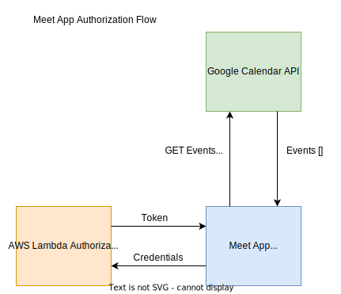

# Meet

Meet is a serverless, progressive web application (PWA) that displays events filtered by city. It is developed using React and a test-driven development (TDD) technique. The application uses the Google Calendar API to fetch upcoming events.

## Key Features

1. Filter events by city.
2. Show/hide event details.
3. Specify number of events.
4. Use the app when offline.
5. Add an app shortcut to the home screen.
6. View a chart showing the number of upcoming events by city.

## User Stories

1. As a user, I would like to be able to filter events by city, so I can view the list of events that take place in a city.
2. As a user, I would like to be able to show/hide the event details, so I can see more/less details abount an event.
3. As a user, I would like to specify the number of events I can view in the app, so I can see more/less events in the event list at once.
4. As a user, I would like to be able to use the app when offline, so I see view the events I viewed the last time I was online
5. As a user, I would like to be able to add the app shortcut to the home screen, so I can open the app faster.
6. As a user, I would like to be able to see a chart showing the upcoming events in each city, so I know which events are organised in each city

## Scenarios

### Feature 1 - Filter events by city

#### Scenario 1: When user hasn’t searched for a city, show upcoming events from all cities.
- **Given**: the user hasn't searched for any city
- **When**: the user opens the app
- **Then**: the user should see a list of all upcoming events

#### Scenario 2: User should see a list of suggestions when they search for a city.
- **Given**: the main page is open
- **When**: the user start typing in the city textbox
- **Then**: the user should see a list of city suggestions that matches what they've typed

#### Scenario 3: User can select a city from the suggested list.
- **Given**: the user was typing "R" in the city textbox and a list of city suggestions is showing
- **When**: the user selects a city from the list (eg. Rome)
- **Then**: the city should change into Rome and the user should receive a list of upcoming events happening in Rome

### Feature 2 - Show/hide event details

#### Scenario 1: An event element is collapsed by default
- **Given**: the app displayed a list of events
- **When**: the user does not interact with any event element
- **Then**: the event element should be collapsed

#### Scenario 2: User can expand an event to see its details
- **Given**: the app displayed a list of events
- **When**: the user interacts with an event element (click/tap/select)
- **Then**: the event element should expand to show the event details

#### Scenario 3: User can collapse an event to hide its details
- **Given**: an event element is expanded
- **When**: the user interacts with an event element (click/tap/select)
- **Then**: the event element should collapse and hide its details

### Feature 3: Specify number of events

#### Scenario 1: When a user hasn't specified a number, 32 is the defaut number
- **Given**: the user hasn't specified the number of events to display
- **When**: the app displays a list of events
- **Then**: the max number of events displayed at once by the app will be 32

#### Scenario 2: User can change the number of events they want to see
- **Given**: the max number of events displayed at once in a list was 32
- **When**: the user change the number of the events to display to 20
- **Then**: the max number of events displayed at once in a list will be 20

### Feature 4: Use the app when offline

#### Scenario 1: Show cached data when there’s no internet connection
- **Given**: the app has cashed a list of events for the city of Rome for the next week
- **When**: the connection is offline and the user wants the app to display the list of events in Rome for the next week
- **Then**: the app displays a list of the events in Rome using its cached data

#### Scenario 2: Show error when user changes the settings (city, time range)
- **Given**: the app has cashed a list of events for the city of Rome for the next week
- **When**: the connection is offline and the user wants the app to display the list of events in Paris for the next month 
- **Then**: the app will display an error message, stating that the request can't be satisfied without an internet connection

### Feature 5: Add an app shortcut to the home screen.

No testable scenarios.

### Feature 6: View a chart showing the number of upcoming events by city

#### Scenario 1: Show a chart with the number of upcoming events in each city
- **Given**: the app is open
- **When**: the user clicks on a menu button to display a chart of the upcoming events by city
- **Then**: the app displays a chart that shows the number of upcoming events for each city

## Data Flow and Serverless Authorization

 The Meet App frontend will make use of data stored in a Google Calendar account via the Google Calendar API. Since the Google Calendar API is protected and requires an authorization token, the app will also make use of an authorization service deployed in a serverless AWS Lambda function. The app will submit its credentials to the Lambda function. If the credentials are valid, the app will receive a JWT token that will be used to submit any request to the Google Calendar API. Here is a diagram of the authorization flow.

